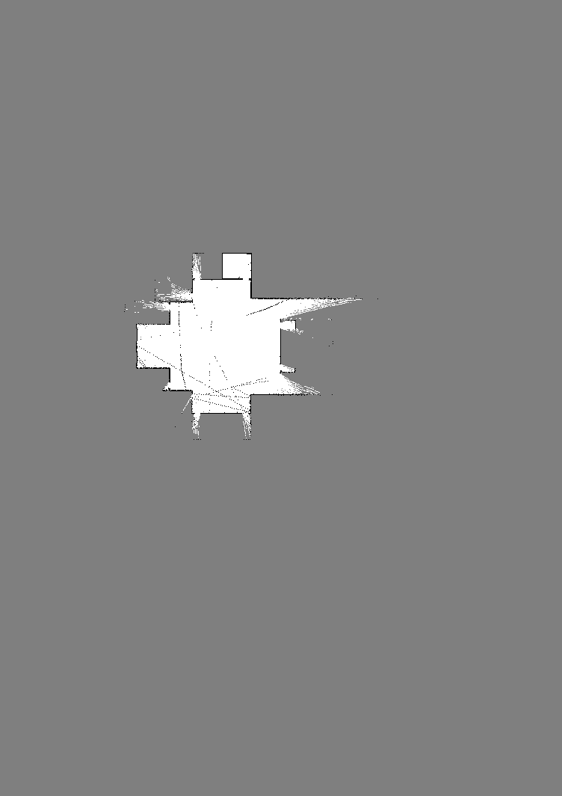
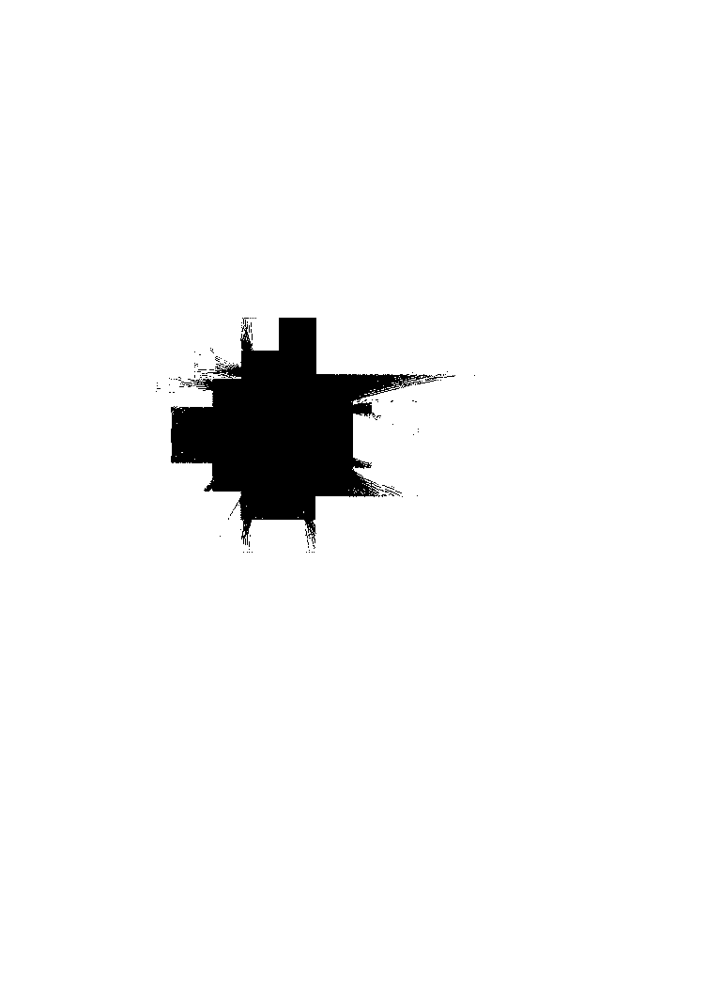
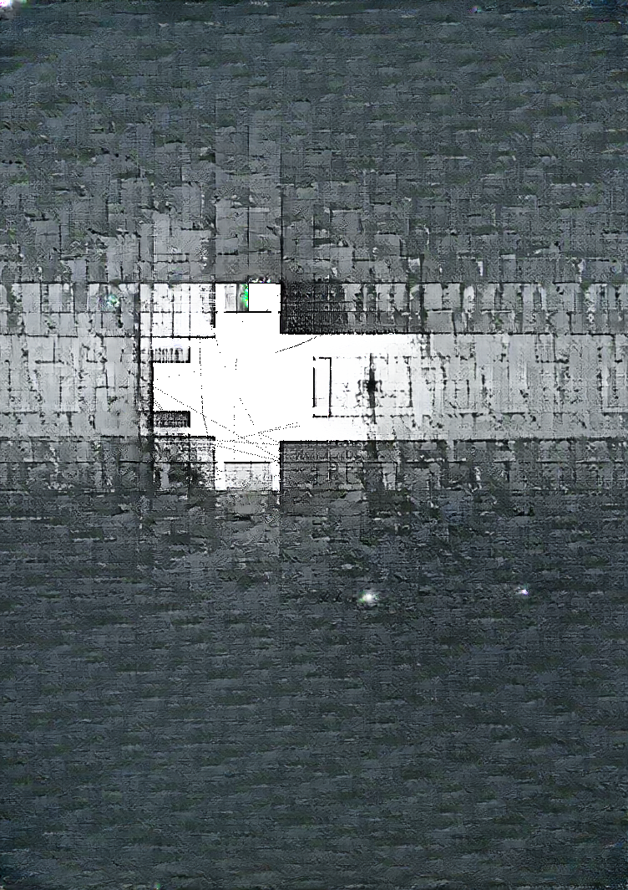
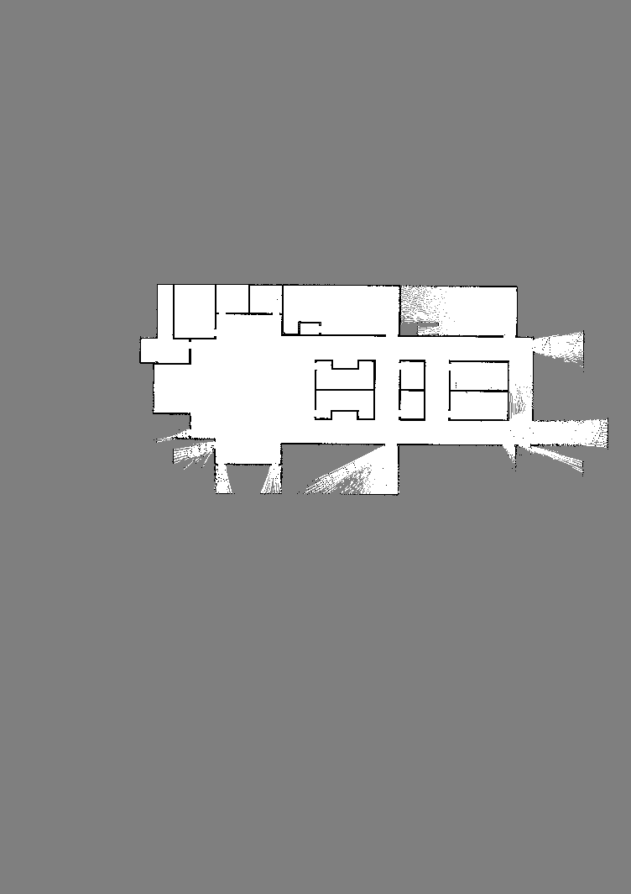
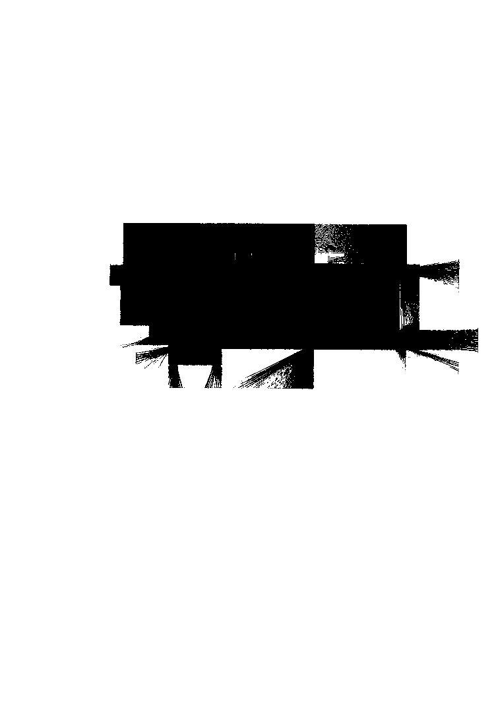
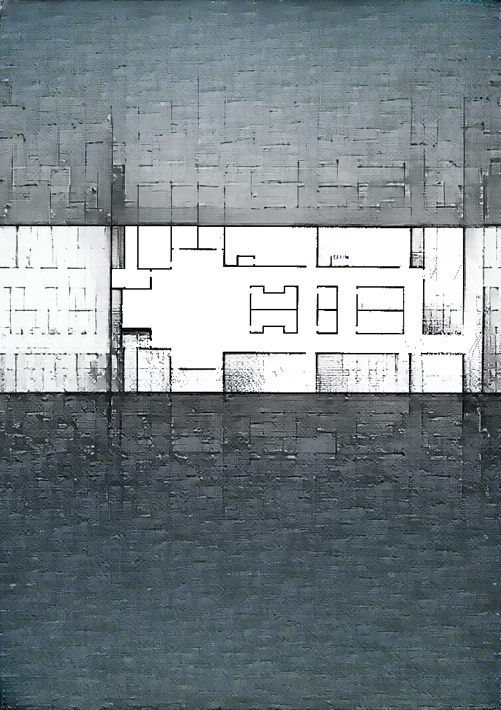
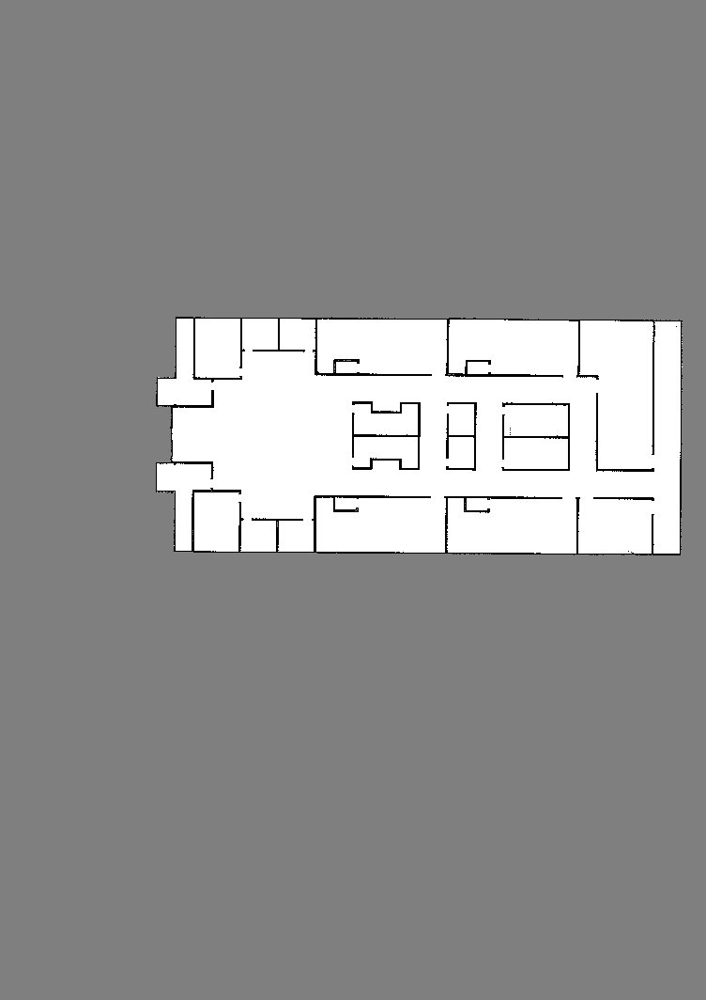
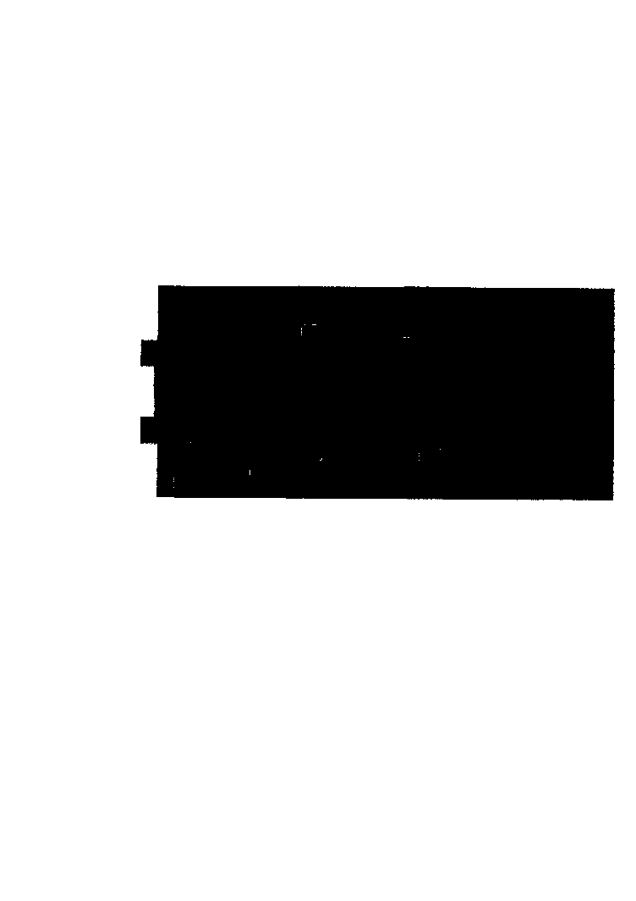
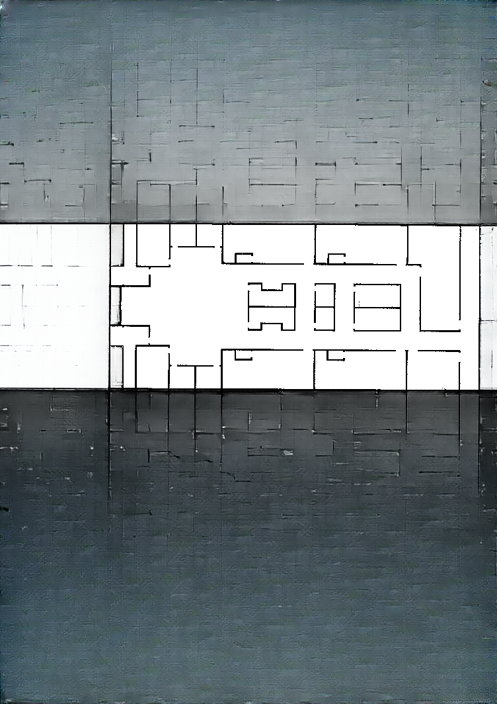

# Representative LaMa checkpoints

Source run: `hospital_flat_lama_01_001`  
Completion: `exploration_complete`  
Full run: 1,416 frames, retained locally only

## Frame 000050 — early exploration

| Model input | Unknown-region mask | LaMa prediction |
| --- | --- | --- |
|  |  |  |

## Frame 000708 — middle exploration

| Model input | Unknown-region mask | LaMa prediction |
| --- | --- | --- |
|  |  |  |

## Frame 001415 — final exploration state

| Model input | Unknown-region mask | LaMa prediction |
| --- | --- | --- |
|  |  |  |

The input and mask are deterministic preprocessing products. The prediction is
qualitative LaMa output and must not be treated as measured ground truth.
