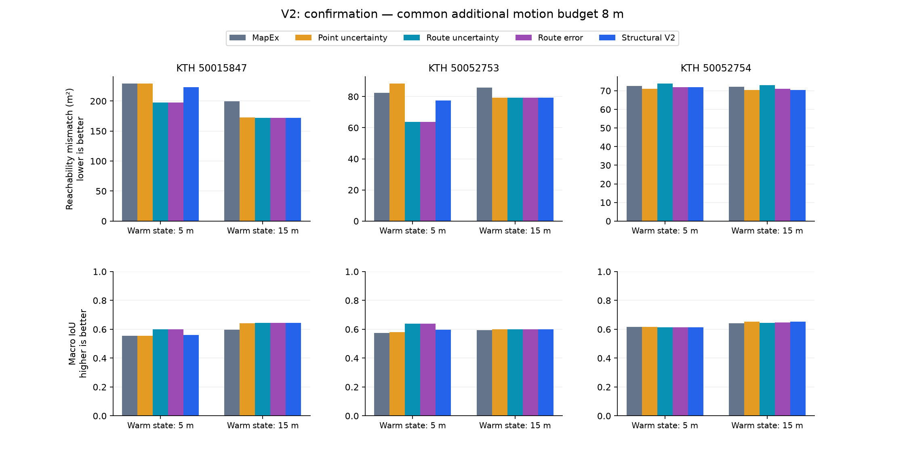

# V2: có tiến bộ so với MapEx, chưa có lợi ích riêng của kiểm chứng cấu trúc

**Ngày:** 2026-10-07. **Trạng thái:** pilot phát triển và kiểm tra trên layout
mới với policy; self-validation, chưa QA độc lập.

**Kết luận:** bản V2 giảm mismatch reachable so với MapEx ở 6/6 trạng thái trên
ba layout mới. Nhưng đối chứng chỉ chấm lỗi dọc đường vẫn tốt hơn V2 về trung
bình, và audit đường đi dự đoán không ủng hộ phần cấu trúc. Chưa đủ bằng chứng
chốt heuristic mở/đóng patch thành đóng góp chính của đồ án.

## Mục tiêu và thay đổi

V1 đã cho kết quả âm. V2 kiểm tra ba sửa đổi: ước lượng lỗi dự đoán thay vì chỉ
độ bất đồng ensemble, tính thông tin trên phần route thực sự đi được trong
budget, và tính tác động khi chỉ quan sát được một phần patch cấu trúc.

Mô hình lỗi là logistic nhỏ dùng mean/variance/votes, khoảng cách tới vùng
đã biết và cạnh cục bộ. Fit trên 96.332 cells của sáu trạng thái V1, trọng số
bằng nhau cho mỗi trạng thái. Đây là supervised fit offline bằng ground truth
development; không huấn luyện lại LaMa. Runtime chỉ thấy observation,
prediction, pose/budget và coefficients đã freeze.

Ba phương pháp V2 dùng chung candidate pool, route prefix khả thi, chi phí,
1 m preference và visibility estimator:

- `route_uncertainty`: variance trong vùng dự kiến thấy dọc route / path cost.
- `route_error`: diện tích lỗi ước lượng thấy được dọc route / path cost.
- `structural_v2`: route error cộng tác động của sửa một phần cấu trúc.

Mean estimated cell error chỉ là trọng số heuristic của hypothesis. Nó không
phải xác suất cả patch cần mở/đóng. Counterfactual giữ prediction bên ngoài
patch cố định, trong khi LaMa thực tế có thể cập nhật toàn bản đồ. Công thức,
sensor approximation và lệnh chạy nằm trong [README_V2.md](README_V2.md).

Pathwise information gain đã có trong [PIPE](https://arxiv.org/abs/2503.07504).
Đối chứng của pilot lấy cảm hứng từ PIPE nhưng không tái lập chính xác
probabilistic raycast/polygon union của paper. Không coi riêng pathwise scoring
là đóng góp mới. [MapEx](https://arxiv.org/abs/2409.15590) vẫn là backend và
baseline 2D adapter.

## Thiết lập và chống lẫn dữ liệu

- Development: New Room, KTH 50052751/752, mỗi layout hai trạng thái 5 m/15 m.
  Chạy 18 nhánh V2 mới và tái dùng 12 baseline V1 có provenance.
- New-layout check: KTH 50015847/753/754, mỗi layout hai trạng thái 5 m/15 m,
  chạy mới năm phương pháp, tổng 30 nhánh. IDs chọn trước inference/kết quả.
- Tổng **48 nhánh mới**, đều dùng đủ 8 m, không va chạm. Không dùng Gazebo.
- V1 code/model/physics/metric giữ nguyên. V2 protocol, coefficients và assets
  được commit trước inference tại `7869e802`; source/model/inputs được seal.
  Không retune hoặc loại layout sau kết quả.
- Sensor thực thi 2.500 tia, quan sát mỗi 0.3 m; policy V2 dùng approximation
  360 tia ở checkpoint 1 m và target-directed patch rays.
- "New" là mới với error estimator/policy trong pilot này. Chưa xác minh
  building holdout hoặc LaMa-training holdout. Hai trạng thái cùng layout
  phụ thuộc nhau; đây là bằng chứng sơ bộ, không phải kiểm định tổng quát.

## Kết quả endpoint chính trên layout mới

Mismatch reachable cuối nhánh, m², càng thấp càng tốt:

| Layout / warm state | MapEx | Point uncertainty | Route uncertainty | Route error | Structural V2 |
|---|---:|---:|---:|---:|---:|
| KTH 50015847 / 5 m | 228.92 | 228.92 | 197.32 | 197.32 | 223.19 |
| KTH 50015847 / 15 m | 199.52 | 172.81 | 172.08 | 172.08 | 172.08 |
| KTH 50052753 / 5 m | 82.40 | 88.27 | 63.67 | 63.67 | 77.36 |
| KTH 50052753 / 15 m | 85.74 | 79.19 | 79.19 | 79.19 | 79.19 |
| KTH 50052754 / 5 m | 72.67 | 71.02 | 73.79 | 71.85 | 71.85 |
| KTH 50052754 / 15 m | 72.07 | 70.33 | 72.99 | 71.03 | 70.33 |

| Structural V2 so với | Thắng / hòa / kém | Δ mismatch trung bình theo layout | Δ macro IoU trung bình |
|---|---:|---:|---:|
| MapEx | 6 / 0 / 0 | −7.886667 m² | +0.015188 |
| Point uncertainty | 3 / 2 / 1 | −2.756667 m² | +0.003813 |
| Route uncertainty | 2 / 2 / 2 | +5.826667 m² | −0.012016 |
| Route error | 1 / 3 / 2 | +6.476667 m² | −0.012630 |

Δ là V2 trừ đối chứng: mismatch âm có lợi, IoU dương có lợi. `route_error`
là đối chứng chính để tách lợi ích của thành phần cấu trúc. So MapEx tốt hơn
không đủ để chứng minh thành phần này có ích, vì route/error estimator cùng
thay đổi. Trên development, thêm cấu trúc cũng kém `route_error`: thắng 0,
hòa 4, kém 2, mismatch trung bình +1.733333 m².

## Khả năng quan sát đã cải thiện, proxy consequence vẫn yếu

V2 có 4 VERIFY actions trên development và 7 trên layout mới: cả 11 tới đích
và đều quan sát thêm patch. V1 có nhiều VERIFY không tới đích/không quan sát
thêm patch. Đây là cải thiện của cơ chế thực thi mục tiêu trong ngân sách;
nó chưa biến consequence thành giá trị kiểm chứng đáng tin.

Ví dụ KTH 50015847 / 5 m: hypothesis được chấm hypothetical correction
**1.183,04 m²**, dự đoán thấy 29 patch cells; thực tế thấy 10 cells và chỉ 1
cell sai trước quan sát. Final mismatch V2 là 223.19 m², so route_error
197.32 m². Không diễn giải 1.183,04 m² là expected gain của endpoint: score
đếm unknown trên toàn canvas, endpoint dùng evaluation domain cố định.
Ví dụ này cho thấy một alternative có tác động lớn có thể rất thiếu căn cứ.

Đồng thời, pixel error và một sự kiện topology như đóng cả lối đi là hai
đối tượng khác nhau. Lỗi ở vài cells không chứng minh toàn bộ patch nên đảo.
Gain trực tiếp khi prediction khác được giữ cố định cũng chưa dự đoán được
mọi thay đổi LaMa sau phép đo. Không đưa GT evaluation mask vào online policy
để làm score đẹp hơn.

## Reliability và audit navigation bổ sung

Leave-layout-out trên development: mô hình lỗi có Brier tốt hơn constant
prior ở 2/3 layout, kém ở 1/3. Evaluation trên layout mới: tốt hơn constant
prior ở 4/6 trạng thái; trung bình Δ Brier −0.009047. Riêng hai trạng thái
layout lớn đều kém prior; estimated error rate khoảng 21.9–22.5%, trong khi
actual rate khoảng 10.4–11.1%. Chưa có bảo đảm calibration khi chuyển layout.

Audit navigation lập 40 đường/state từ warm pose tới các goal truth-reachable,
chọn bằng seed cố định, cùng queries cho mọi method. Kiểm tra đường tạo từ
completed map có đi qua obstacle thật sau footprint inflation không:

| Method | Đường hợp lệ / tất cả queries, trung bình 6 trạng thái mới |
|---|---:|
| MapEx | 59.17% |
| Point uncertainty | 56.25% |
| Route uncertainty | 60.83% |
| Route error | 61.67% |
| Structural V2 | 55.00% |

Endpoint area và chất lượng đường đi không cùng kết luận: V2 area tốt hơn
MapEx, nhưng audit navigation kém hơn. Vì vậy không dùng một proxy duy nhất
để tuyên bố bản đồ tốt hơn cho navigation. Exploration đi trên observed-free;
audit lập các đường mới qua prediction chưa quan sát. Đây là static diagnostic
bổ sung trong vòng phát triển, không phải navigation execution hay exact TU
100-goal reproduction của MapEx, và không thay primary endpoint đã chốt.

## Kiểm tra và evidence

- **24/24 tests PASS:** 14 V1/budget, 8 V2, 2 navigation audit.
- **863/863 checks V2** và **43/43 checks analysis PASS**: source/model/asset
  hashes, split, CSV, endpoint recomputation, observed-only paths, footprint,
  budget, score selection, query domain và aggregates.
- Self-validation; chưa independent QA ACCEPT.
- Đã sửa lỗi NumPy int ở bước xuất query JSON và thêm kiểm tra query có thể
  serialize, lặp lại đúng seed và nằm trong vùng reachable. Không rerun policy
  hoặc đổi kết quả khoa học vì lỗi xuất dữ liệu này.
- Cache prediction chia sẻ; không dùng wall-clock theo nhánh để so tốc độ.
- KTH reduce 2×2 như V1, odd dimensions pad conservative; không nhận là cùng
  scale/exact setting với benchmark paper. Không có STOP hoặc full-run saving.

Evidence: [seal](results/pilot_v2/seal.json),
[primary validation](results/pilot_v2/validation.json),
[analysis validation](results/pilot_v2/analysis_validation.json),
[confirmation summary](results/pilot_v2/confirmation/summary.json),
[navigation audit](results/pilot_v2/navigation_audit.csv),
[VERIFY outcomes](results/pilot_v2/verify_outcomes.csv).
Raw arrays/cache giữ trên DELL; lightweight rows/action logs/hình/model đã lưu
trong nhánh Git. [GIF](results/pilot_v2/confirmation/pilot_v2_demo.gif) chọn case
đầu tiên cố định, checkpoints không đồng bộ theo thời gian vật lý.

## Quyết định nghiên cứu

Giữ simulator 2D và protocol làm công cụ nghiên cứu. Chưa chốt đóng góp
"hypothetical gate consequence" làm phương pháp chính; không thêm threshold
để cố biến kết quả này thành winner. Tín hiệu đáng giữ là route/error-aware
exploration, nhưng lợi ích của learned error so route uncertainty trên layout
mới còn nhỏ, và pathwise scoring đã có trong PIPE.

Nếu tiếp tục kiểm chứng cấu trúc, cần đổi mục tiêu sang sự kiện ảnh hưởng đến
các đường đi cụ thể và phân biệt pixel noise với topology error; cần model
alternative có căn cứ và dự đoán được tác động cập nhật LaMa. Đây là giả thuyết
nghiên cứu tiếp, chưa là phương pháp đã chứng minh hoặc research gap đã xác nhận.
