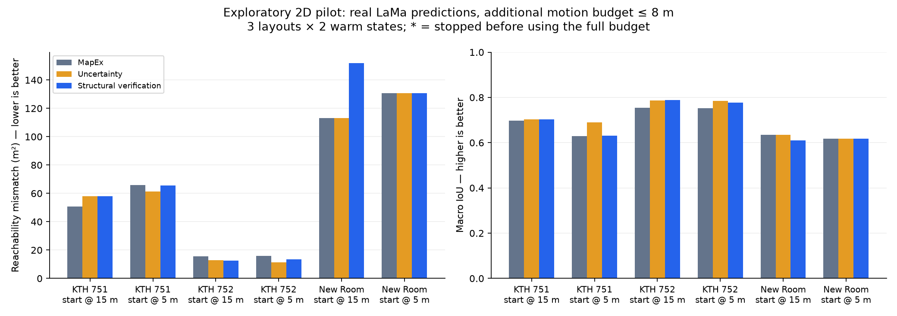

# Kết quả pilot kiểm chứng chủ động trên mô phỏng 2D

**Ngày:** 2026-10-07. **Trạng thái:** development pilot; chưa qua QA độc lập.

**Kết luận:** bộ mô phỏng đã hoạt động và có thể tái lập, nhưng prototype kiểm
chứng cấu trúc hiện chưa vượt đối chứng uncertainty. Chưa có bằng chứng đủ để
chốt hướng này thành đóng góp thuật toán chính của đồ án. Kết quả không bác
bỏ mọi phương pháp kiểm chứng chủ động; nó giới hạn điều đã được thử ở đây.

## Thiết lập

- Không ROS/Gazebo/Nav2; world lưới 2D, pose lý tưởng, sensor không nhiễu.
- Dự đoán bằng ba checkpoint LaMa thật đang có, chạy CPU, không huấn luyện mới.
- Ba layout: New Room, KTH 50052751 và KTH 50052752.
- Hai trạng thái mỗi layout, sinh bằng nearest-frontier sau 5 m và 15 m;
  chọn theo quãng đường trước khi xem lỗi dự đoán.
- Mỗi trạng thái rẽ ba nhánh: MapEx adapter, uncertainty, structural verification.
  Cùng bản đồ/pose ban đầu và ngân sách thêm 8 m.
- 18 nhánh chính và 6 nhánh structural bổ sung để chẩn đoán tính khả thi theo
  ngân sách. Tất cả dùng đủ 8 m, không có va chạm.

Structural verification tạo giả thuyết mở/đóng cục bộ tại lối hẹp hoặc vật
cản mỏng có vùng trống ở hai phía. Chỉ sửa vùng chưa quan sát trong giả thuyết;
chấm điểm bằng consequence cấu trúc × visibility / path distance. Consequence
là độ nhạy thành phần reachable, chưa phải xác suất dự đoán sai.

Endpoint chính là diện tích sai khác reachable giữa bản đồ hoàn thiện và
ground truth, có xét kích thước robot: càng thấp càng tốt. Đây là proxy
connectivity/area; chưa đánh giá đầy đủ mọi đường đi downstream. Macro IoU là
endpoint phụ. Ground truth không đi vào bộ chọn hành động.

## Kết quả chính

Mismatch reachable cuối nhánh, đơn vị m²:

| Layout / trạng thái | MapEx | Uncertainty | Structural V1 | Structural trong budget |
|---|---:|---:|---:|---:|
| New Room / 5 m | 130.58 | 130.58 | 130.58 | 130.58 |
| New Room / 15 m | 113.03 | 113.03 | 152.02 | 113.03 |
| KTH 50052751 / 5 m | 66.02 | 61.27 | 65.50 | 65.50 |
| KTH 50052751 / 15 m | 50.74 | 58.05 | 58.05 | 58.05 |
| KTH 50052752 / 5 m | 15.93 | 11.45 | 13.58 | 14.28 |
| KTH 50052752 / 15 m | 15.68 | 12.90 | 12.64 | 15.68 |

- Structural V1 thắng uncertainty ở **1/6** trạng thái, hòa 2 và kém 3.
  Mismatch trung bình theo layout cao hơn **7.515 m²**; macro IoU thấp hơn
  **0.014951**. So MapEx, thắng 3/6 nhưng mismatch trung bình vẫn cao hơn
  **6.731667 m²**, chủ yếu do một case New Room kém rõ.
- Biến thể trong budget thắng uncertainty **0/6**, hòa 3 và kém 3;
  mismatch trung bình vẫn cao hơn **1.64 m²**. So MapEx, thắng 2/6, hòa 3,
  kém 1; mismatch trung bình cao hơn **0.856667 m²**.
- Hai warm states mỗi layout không độc lập. Các trung bình theo layout chỉ
  mô tả pilot; không phải bằng chứng thống kê tổng quát hay held-out validation.

## Điều đã học được

V1 phát sinh 10 hành động VERIFY, nhưng 6 không tới được mục tiêu trước khi
hết budget; 5 không thu thêm quan sát nào của patch được chọn. Một số cấu trúc
có consequence lớn ở quá xa hoặc visibility dự đoán chưa phản ánh đúng phép
đo thực tế. Di chuyển trên đường vẫn có thể thu thông tin, nên các nhánh này
được giữ nguyên; không xóa hoặc gọi là thí nghiệm hỏng.

Biến thể trong budget còn 5 hành động VERIFY và cả 5 đều tới đích; 1 hành động
vẫn không quan sát thêm patch. Nó tránh được case New Room tệ nhất, nhưng
chưa làm điểm consequence tốt hơn uncertainty. Không chọn biến thể này làm
"winner" để thay kết quả V1.

Oracle chẩn đoán một hành động trong cùng tập view cho thấy **4/6** trạng thái
có headroom trực tiếp về cấu trúc. Hai case KTH 50052751 có gain tốt nhất
**20.54 m²** và **7.66 m²** khi prediction còn lại được giữ cố định. Đây là
gợi ý còn thông tin có thể khai thác; không chứng minh thuật toán mới đạt được
gain đó, không phải upper bound của toàn bộ closed-loop, và không bao gồm
thay đổi LaMa sau quan sát.

Gate U FAIL trong chương trình STOP cũ không đồng nghĩa uncertainty-based
action selection luôn kém. Pilot này cho thấy đối chứng đó vẫn đáng giữ.

## Kiểm tra và giới hạn

- 14/14 kiểm tra tự động qua: sensor occlusion, motion/footprint, path qua vùng
  đã quan sát, bảo toàn known cells, policy không có truth, strict frontier
  threshold, metric topology và eligibility theo budget.
- Artifact V1: 147/147 checks; ablation: 51/51 checks. Endpoint được recompute
  từ arrays cuối, đối chiếu hash warm-start và quãng đường thực thi. Đây là
  **self-validation**, không phải independent QA ACCEPT.
- Một lỗi null hypothesis ở ghi summary đã được sửa; lần chạy lỗi giữ trong
  thư mục debug riêng, không trộn vào 18 nhánh chính. Protocol/scoring V1 giữ
  nguyên; ablation sau kết quả được đánh dấu riêng.
- Snapshot SLAM cũ chỉ được audit; không dùng để lấp observation cho ideal
  simulator, không đổi đánh giá lịch sử.
- Cache prediction chia sẻ giúp chạy nhanh; không dùng wall-clock theo nhánh
  để kết luận tiết kiệm thời gian robot. Đây là phép so ở cùng quãng đường.
- Chưa có chính sách STOP, chưa chứng minh tiết kiệm khám phá đầy đủ, chưa
  có layout confirmation mới, và chưa chứng minh tính mới so với literature.

## Quyết định nghiên cứu đề xuất

Giữ simulator 2D làm công cụ thử nhanh. Chưa chuyển toàn bộ đồ án sang
prototype này. Bước có ích tiếp theo là đối chiếu các view có oracle gain
với view thuật toán chọn: căn cứ sinh giả thuyết, khả năng thực sự quan sát
patch và giá trị quan sát dọc đường. Không ưu tiên thêm threshold STOP hoặc
huấn luyện lại LaMa khi tầng chọn hành động chưa có lợi ích riêng rõ.

Toàn bộ số liệu: `results/pilot_v1/` và `results/budget_ablation/`.
Raw arrays và inference cache giữ trên DELL, dưới cùng thư mục pilot; mã và
assets nhỏ cho phép sinh lại. `README.md` có lệnh chạy và mô tả protocol.
